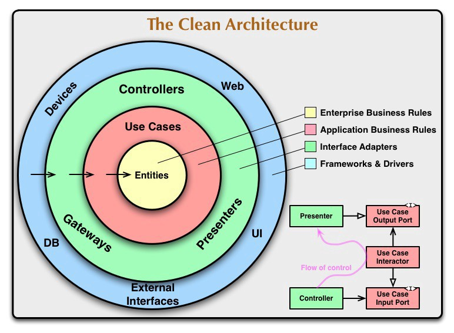

[](https://dart.dev/tools/linter-rules)
[](https://flutter.dev/)
[](https://dart.dev/)
[](https://opensource.org/licenses/Apache-2.0)

<p align="center"> 
    
</p>

<h1 align="center"> Rorty Flutter </h1>

# Rorty 📺 (work-in-progress for V2 👷🔧️👷‍♀️⛏)

## Getting Started

Flutter Clean Architecture in Rorty is a sample project that presents modern, approach to [Flutter](https://flutter.dev/) application development using [Dart](https://dart.dev/) and latest tech-stack.

The goal of the project is to demonstrate best practices, provide a set of guidelines, and present modern Flutter
application architecture that is modular, scalable, maintainable and testable. This application may look simple, but it
has all of these small details that will set the rock-solid foundation of the larger app suitable for bigger teams and
long application lifecycle management.

A flutter app built using Kotlin that consumes [Rick and Morty API](https://rickandmortyapi.com) to display characters,episodes,Location from the [TV Series](https://www.imdb.com/title/tt2861424/). It has been built following Clean Architecture Principle, Repository Pattern, MVVM Architecture in the presentation layer.

## Architecture
A well planned architecture is extremely important for an app to scale and all architectures have one common goal- to manage complexity of your app. This isn't something to be worried about in smaller apps however it may prove very useful when working on apps with longer development lifecycle and a bigger team.

Clean architecture was proposed by [Robert C. Martin](https://en.wikipedia.org/wiki/Robert_C._Martin) in 2012 in the [Clean Code Blog](http://blog.cleancoder.com/uncle-bob/2012/08/13/the-clean-architecture.html) and it follow the SOLID principle.

<p align="center"></p>

### Why Clean Architecture?
- ```Loose coupling between the code``` - The code can easily be modified without affecting any or a large part of the app's codebase thus easier to scale the application later on.
- Easier to ```test``` code.
- ```Separation of Concern``` - Different modules have specific responsibilities making it easier for modification and maintenance.

### S.O.L.I.D Principles

- [__Single Responsibility__](https://en.wikipedia.org/wiki/Single-responsibility_principle): Each software component should have only one reason to change – one responsibility.

- [__Open-Closed__](https://en.wikipedia.org/wiki/Open%E2%80%93closed_principle#:~:text=In%20object%2Doriented%20programming%2C%20the,without%20modifying%20its%20source%20code.): You should be able to extend the behavior of a component, without breaking its usage, or modifying its extensions.

- [__Liskov Substitution__](https://en.wikipedia.org/wiki/Liskov_substitution_principle): If you have a class of one type, and any subclasses of that class, you should be able to represent the base class usage with the subclass, without breaking the app.

- [__Interface Segregation__](https://en.wikipedia.org/wiki/Interface_segregation_principle): It’s better to have many smaller interfaces than a large one, to prevent the class from implementing the methods that it doesn’t need.

- [__Dependency Inversion__](https://en.wikipedia.org/wiki/Dependency_inversion_principle): Components should depend on abstractions rather than concrete implementations. Also higher level modules shouldn’t depend on lower level modules.

## Layers

### Project Structure
<p align="center"></p>

### Data
The ```data``` layer is responsible for selecting the proper data source for the domain layer. It contains the implementations of the repositories declared in the domain layer.

### Domain
This is the core layer of the application. The ```domain``` layer is independent of any other layers thus ] domain business logic can be independent from other layers.This means that changes in other layers will have no effect on domain layer eg.  screen UI (presentation layer) or changing database (data layer) will not result in any code change withing domain layer.

### Presentation
The ```presentation``` layer contains components involved in showing information to the user. The main part of this layer are the BLOC pattern.


## Screenshots

#### Android
<table>
  <tr>
    <td>Light</td>
    <td>Dark</td>
  </tr>
  <tr>
    <td></td>
    <td></td>
  </tr>
 </table>

#### iOS
<table>
  <tr>
    <td>Light</td>
    <td>Dark</td>
  </tr>
  <tr>
    <td></td>
    <td></td>
  </tr>
 </table>

# Tech Stacks
This project uses many of the popular libraries, plugins and tools of the flutter ecosystem.
- [Flutter Bloc](https://pub.dev/packages/flutter_bloc) - Widgets that make it easy to integrate blocs and cubits into Flutter.
- [Equatable](https://pub.dev/packages/equatable) - Being able to compare objects in Dart often involves having to override the == operator as well as hashCode.
- [Get It](https://pub.dev/packages/get_it) - Dependency Injection library.
- [Dio](https://pub.dev/packages/dio) - A powerful Http client for Dart, which supports Interceptors, FormData, Request Cancellation, File Downloading, Timeout etc.
- [Shared Preferences](https://pub.dev/packages/shared_preferences) - Flutter plugin for reading and writing simple key-value pairs. Wraps NSUserDefaults on iOS and SharedPreferences on Android.
- [Logger](https://pub.dev/packages/logger) - Small, easy to use and extensible logger which prints beautiful logs.
